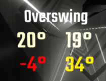

# OverswingCounter

The Game version(s) specific releases are compatible with are mentioned in the Release title (Its obviously possible latest is not supported assuming its been released recently). If you need the plugin for an older version - Grab an older release that fits 🤯

### Install

Click on [releases](https://github.com/kinsi55/BeatSaber_OverswingCounter/releases), download the dll from the latest release and place it in your plugins folder.

---

### Functional principle

***This counter primarily focuses on the pre-swing angle, but its not just that and once you realize how it works you know why:***

- Cuts which had no other cut with the same saber within a given timespan are ignored (By default 0.6 seconds, configureable / disableable)
- For multiple cuts in the same Swing only the first cut is taken into account. When you have situations like sliders or crosses you obviously do have overswing on the followthrough cuts, but thats not something you can change
- If you have a bottom row down Swing followed by a top row up Swing (Works for any angle, the thing that matters is that the second Swing roughly started where the first one ended), because of the first post-swing, your next pre-swing will obviously probably be too big. In this situation the amount you overswung will be determined by the previous post-swing (If that yields a lower number, which it almost always will).
- Double directionals are a special case. As previously mentioned, the counter is split in Down and Up Swings. Where you have double downs, as soon as you cut the second block, the counter will take the previous cuts post-overswing and add that into the bottom value.

***You can interpret the numbers in two different ways:***

Either the lower values are how much you overswing on your pre-swing *coming from the bottom*, or it is how much you overswing on your post-swing *going to the bottom* - Vice versa. The latter is more consistent when accounting for the case of double downs. Each of the values has its own history / averaging timespan

***Somewhat accurate TL;DR: If the lower number is big you are overswinging on your down post-swings, vice versa.***

Caveats:

- **It does not work in (New) replays**, works in old ones (As much as possible anyways). I'm not sure if I'll ever be able to change that, so you probably want to record yourself playing if you want to analyze it after the fact.
- The splitting of the values into Up and Down happens based off your swing angle, so for 90 degree's its kinda "random"
